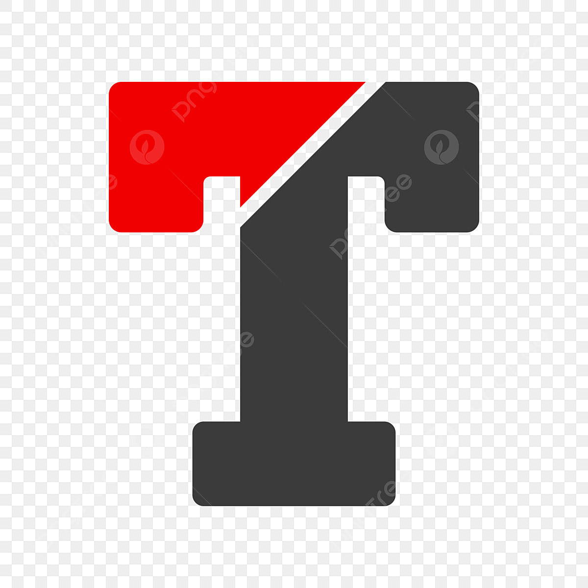

#  Tenzies - The Dice Rolling Game


Tenzies is an exciting dice rolling game where the objective is to roll the dice until all of them show the same value. The game provides a simple and fun way to test your luck and see if you can achieve the perfect roll!

## How to Play

1. Open the Tenzies website in your browser.

2. You will be presented with a screen containing ten dice.

3. Click the "Roll" button to start the game. All the dice will be rolled simultaneously.

4. After each roll, click on the individual dice you want to "freeze" at their current value. The rest of the dice will be rolled again.

5. Keep clicking the "Roll" button and freezing dice until all the dice show the same value.

6. Once you achieve the same value on all ten dice, you win the game!

7. Challenge yourself to complete the game in the fewest rolls possible.

## How to Run Locally

To run the Tenzies website locally on your computer, follow these steps:

1. Clone the repository to your local machine:

```git clone https://github.com/your-username/tenzies.git```

2. Navigate to the project directory:

```cd tenzies```


3. Open the `index.html` file in your web browser.

4. Play the game by following the on-screen instructions.

## Technologies Used

- HTML
- CSS
- JavaScript
- React JS

## Contributing

We welcome contributions to make Tenzies even better! If you have any ideas, bug fixes, or enhancements, feel free to open an issue or submit a pull request.

## License

Tenzies is licensed under the GPL V3 License. See [LICENSE](LICENSE.md) for more details.

Enjoy the game, and may the dice be in your favor! 🎲🎲🎲


